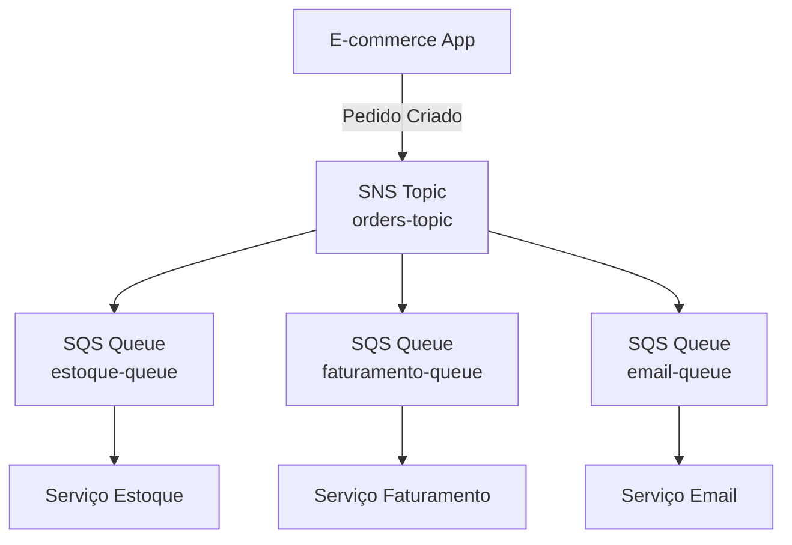
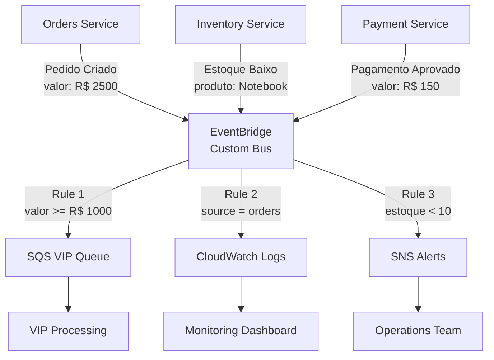
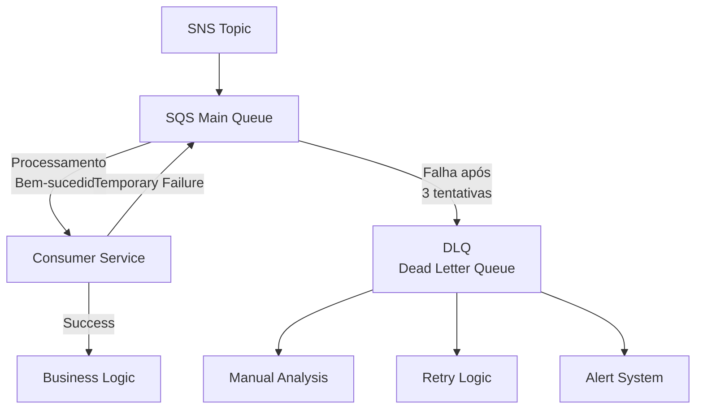
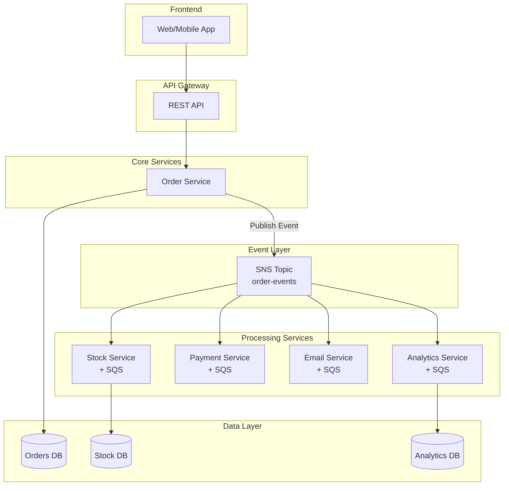
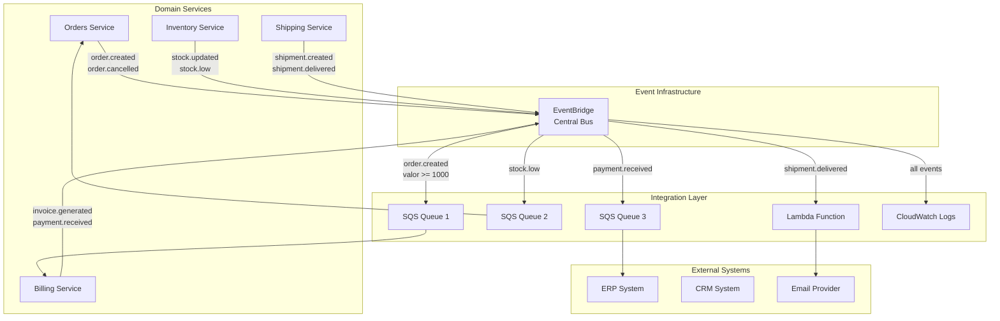
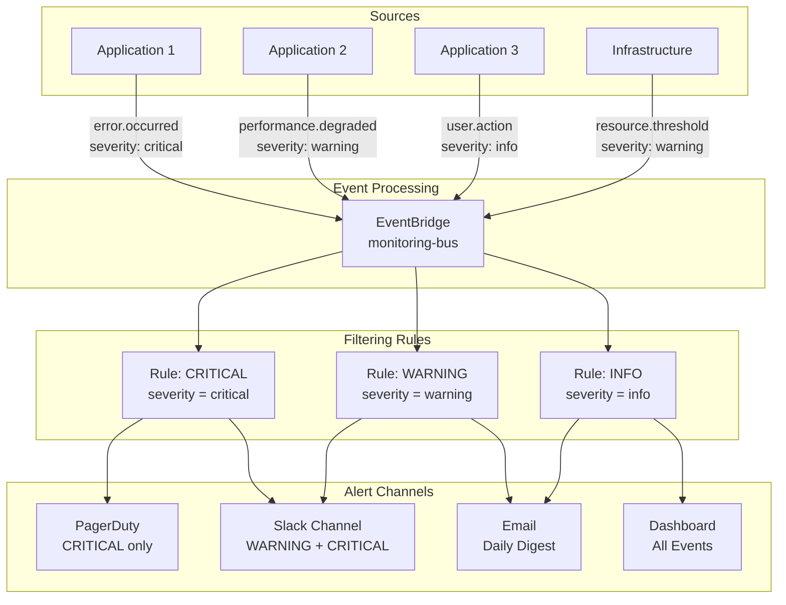

# Diagramas de Arquitetura: Escalabilidade com Eventos

## 🏗️ Padrões Fundamentais

### 1. Fanout Pattern - SNS para SQS

**Características:**
- **1:N Distribution**: Um evento distribui para múltiplos consumidores
- **Desacoplamento**: Produtor não conhece consumidores
- **Paralelismo**: Processamento simultâneo
- **Durabilidade**: SQS garante entrega

---

### 2. Event Filtering - EventBridge com Regras

**Características:**
- **Content-based Routing**: Filtros por conteúdo do evento
- **Multiple Sources**: Vários produtores, um barramento
- **Flexible Targets**: Diferentes tipos de destino
- **No Code Filtering**: Regras declarativas

---

### 3. Dead Letter Queue Pattern

**Características:**
- **Fault Tolerance**: Recuperação de mensagens com falha
- **Observability**: Análise de problemas
- **Data Protection**: Zero perda de mensagens
- **Operational Insight**: Métricas de saúde

---

## 🎯 Arquiteturas Reais

### E-commerce: Processamento de Pedidos

**Benefícios:**
- **Checkout Rápido**: API retorna imediatamente
- **Processamento Paralelo**: Serviços independentes
- **Escalabilidade**: Cada serviço escala independentemente
- **Resiliência**: Falha em um serviço não afeta outros

---

### Microsserviços: Event-Driven Communication

**Benefícios:**
- **Loose Coupling**: Serviços não se conhecem diretamente
- **Independent Deployment**: Deploy sem coordenação
- **Event Governance**: Controle centralizado
- **Easy Integration**: Novos consumidores sem impacto

---

### Monitoramento: Alertas Inteligentes

**Benefícios:**
- **Noise Reduction**: Apenas alertas relevantes
- **Contextual Routing**: Canal certo para cada severidade
- **Operational Efficiency**: Menos fadiga de alertas
- **Centralized Management**: Uma fonte de verdade

---

## 📚 Referências dos Diagramas

### Ferramentas Utilizadas
- **Mermaid**: Para diagramas de fluxo

---

*Diagramas atualizados em: 01/10/2025*  
*Versão: 1.0*