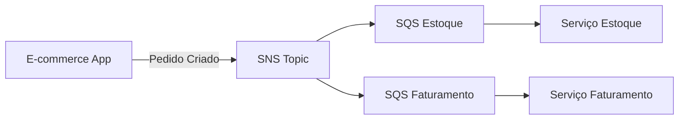
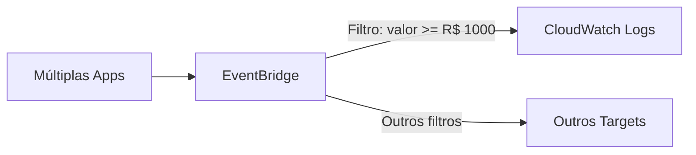

# Guia dos Exercícios: Escalabilidade com Eventos

## 📚 Visão Geral da Live
**Curso:** POSTECH - DevOps e Arquitetura Cloud  
**Professor:** José Neto  
**Ambiente:** AWS Learner Lab (CloudShell)

---

## 🎯 Objetivos de Aprendizagem
Ao final desta live, você será capaz de:
- ✅ **Entender** quando usar SQS, SNS e EventBridge
- ✅ **Aplicar** padrões de escalabilidade (fanout, event filtering)
- ✅ **Operar** via AWS CLI com boas práticas
- ✅ **Desenhar** arquiteturas event-driven

---

## ⚠️ Pré-requisitos Obrigatórios

### Ambiente AWS Learner Lab
- [ ] **Sessão iniciada** no Learner Lab
- [ ] **Região us-east-1** configurada
- [ ] **CloudShell** aberto no console AWS

### Verificação Rápida
```bash
# Execute no CloudShell antes de começar:
export AWS_PROFILE=fiapaws
aws sts get-caller-identity --profile fiapaws
aws configure list --profile fiapaws
aws iam get-role --role-name LabRole --profile fiapaws
```

---

## 📋 Lista de Exercícios (9 exercícios)

### **Exercício 0: Preparação do Ambiente**
⏱️ **Tempo:** 2 minutos  
🎯 **Objetivo:** Configurar variáveis e verificar ambiente AWS

**O que você vai fazer:**
- Definir variáveis PREFIX e AWS_REGION
- Verificar identidade AWS e LabRole
- Configurar região padrão

**Comandos para executar:**
```bash
# 1. Definir variáveis do ambiente
export PREFIX=fiap-$(date +%s)
export AWS_REGION=us-east-1
export AWS_PROFILE=fiapaws

# 2. Verificar identidade AWS
aws sts get-caller-identity --profile $AWS_PROFILE

# 3. Configurar região padrão para o perfil
aws configure set region $AWS_REGION --profile $AWS_PROFILE

# 4. Verificar LabRole disponível
aws iam get-role --role-name LabRole --query 'Role.RoleName' --output text --profile $AWS_PROFILE
```

**Conceitos aprendidos:**
- AWS CLI básico
- Variáveis de ambiente
- IAM roles no Learner Lab

---

### **Exercício 1: Criar SNS Topic**
⏱️ **Tempo:** 3 minutos  
🎯 **Objetivo:** Criar tópico SNS para publicar eventos de pedidos

**O que você vai fazer:**
- Criar SNS topic com nome único
- Obter ARN do topic criado
- Verificar criação bem-sucedida

**Comandos para executar:**
```bash
# 1. Criar SNS Topic
aws sns create-topic --name $PREFIX-pedidos --region $AWS_REGION --profile $AWS_PROFILE

# 2. Obter ARN do topic criado
export TOPIC_ARN=$(aws sns list-topics --region $AWS_REGION --profile $AWS_PROFILE --query "Topics[?contains(TopicArn, \`${PREFIX}-pedidos\`)].TopicArn" --output text)

# 3. Verificar se foi criado
echo "✅ Topic criado: $TOPIC_ARN"
```

**Conceitos aprendidos:**
- SNS (Simple Notification Service)
- ARNs (Amazon Resource Names)
- Naming conventions

**Arquitetura:**
```
[Aplicação] → [SNS Topic: pedidos]
```

---

### **Exercício 2: Criar Filas SQS**
⏱️ **Tempo:** 3 minutos  
🎯 **Objetivo:** Criar filas SQS para receber eventos do SNS

**O que você vai fazer:**
- Criar 2 filas SQS (estoque e faturamento)
- Obter URLs e ARNs das filas
- Verificar criação de ambas as filas

**Comandos para executar:**
```bash
# 1. Criar fila para serviço de estoque
aws sqs create-queue --queue-name $PREFIX-estoque --region $AWS_REGION --profile $AWS_PROFILE

# 2. Criar fila para serviço de faturamento
aws sqs create-queue --queue-name $PREFIX-faturamento --region $AWS_REGION --profile $AWS_PROFILE

# 3. Obter URLs das filas
export QUEUE_ESTOQUE_URL=$(aws sqs get-queue-url --queue-name $PREFIX-estoque --region $AWS_REGION --profile $AWS_PROFILE --query QueueUrl --output text)
export QUEUE_FATURAMENTO_URL=$(aws sqs get-queue-url --queue-name $PREFIX-faturamento --region $AWS_REGION --profile $AWS_PROFILE --query QueueUrl --output text)

# 4. Obter ARNs das filas
export QUEUE_ESTOQUE_ARN=$(aws sqs get-queue-attributes --queue-url $QUEUE_ESTOQUE_URL --attribute-names QueueArn --region $AWS_REGION --profile $AWS_PROFILE --query Attributes.QueueArn --output text)
export QUEUE_FATURAMENTO_ARN=$(aws sqs get-queue-attributes --queue-url $QUEUE_FATURAMENTO_URL --attribute-names QueueArn --region $AWS_REGION --profile $AWS_PROFILE --query Attributes.QueueArn --output text)

# 5. Verificar se foram criadas
echo "✅ Filas criadas:"
echo "   Estoque: $QUEUE_ESTOQUE_ARN"
echo "   Faturamento: $QUEUE_FATURAMENTO_ARN"
```

**Conceitos aprendidos:**
- SQS (Simple Queue Service)
- Queue URLs vs ARNs
- Múltiplas filas para diferentes serviços

**Arquitetura:**
```
[SNS Topic] → [SQS Estoque]
             → [SQS Faturamento]
```

---

### **Exercício 3: Configurar Permissões SNS → SQS**
⏱️ **Tempo:** 4 minutos  
🎯 **Objetivo:** Permitir que SNS envie mensagens para filas SQS

**O que você vai fazer:**
- Configurar resource-based policy nas filas SQS
- Permitir sns.amazonaws.com como principal
- Adicionar condição de source ARN para segurança

**Comandos para executar:**
```bash
# 1. Configurar permissão para fila de estoque
aws sqs set-queue-attributes \
  --queue-url $QUEUE_ESTOQUE_URL \
  --region $AWS_REGION \
  --profile $AWS_PROFILE \
  --attributes "{\"Policy\":\"{\\\"Version\\\":\\\"2012-10-17\\\",\\\"Statement\\\":[{\\\"Effect\\\":\\\"Allow\\\",\\\"Principal\\\":{\\\"Service\\\":\\\"sns.amazonaws.com\\\"},\\\"Action\\\":\\\"sqs:SendMessage\\\",\\\"Resource\\\":\\\"$QUEUE_ESTOQUE_ARN\\\",\\\"Condition\\\":{\\\"ArnEquals\\\":{\\\"aws:SourceArn\\\":\\\"$TOPIC_ARN\\\"}}}]}\"}"

# 2. Configurar permissão para fila de faturamento
aws sqs set-queue-attributes \
  --queue-url $QUEUE_FATURAMENTO_URL \
  --region $AWS_REGION \
  --profile $AWS_PROFILE \
  --attributes "{\"Policy\":\"{\\\"Version\\\":\\\"2012-10-17\\\",\\\"Statement\\\":[{\\\"Effect\\\":\\\"Allow\\\",\\\"Principal\\\":{\\\"Service\\\":\\\"sns.amazonaws.com\\\"},\\\"Action\\\":\\\"sqs:SendMessage\\\",\\\"Resource\\\":\\\"$QUEUE_FATURAMENTO_ARN\\\",\\\"Condition\\\":{\\\"ArnEquals\\\":{\\\"aws:SourceArn\\\":\\\"$TOPIC_ARN\\\"}}}]}\"}"

# 3. Verificar configuração
echo "✅ Permissões configuradas para ambas as filas"
```

**Conceitos aprendidos:**
- IAM resource-based policies
- Cross-service permissions
- Security best practices (source ARN condition)
- JSON policy structure

---

### **Exercício 4: Criar Subscriptions SNS → SQS**
⏱️ **Tempo:** 2 minutos  
🎯 **Objetivo:** Conectar filas SQS ao tópico SNS

**O que você vai fazer:**
- Criar subscription da fila estoque ao topic
- Criar subscription da fila faturamento ao topic
- Verificar subscriptions ativas

**Comandos para executar:**
```bash
# 1. Conectar fila de estoque ao topic
aws sns subscribe --topic-arn $TOPIC_ARN --protocol sqs --notification-endpoint $QUEUE_ESTOQUE_ARN --region $AWS_REGION --profile $AWS_PROFILE

# 2. Conectar fila de faturamento ao topic
aws sns subscribe --topic-arn $TOPIC_ARN --protocol sqs --notification-endpoint $QUEUE_FATURAMENTO_ARN --region $AWS_REGION --profile $AWS_PROFILE

# 3. Verificar subscriptions criadas
aws sns list-subscriptions-by-topic --topic-arn $TOPIC_ARN --region $AWS_REGION --profile $AWS_PROFILE --query 'Subscriptions[].{Protocol:Protocol,Endpoint:Endpoint}' --output table

echo "✅ Subscriptions criadas com sucesso!"
```

**Conceitos aprendidos:**
- SNS subscriptions
- Protocol types (SQS)
- Pub/Sub pattern setup

**Arquitetura completa:**
```
[App] → [SNS Topic] ⟷ [SQS Estoque] → [Serviço Estoque]
                    ⟷ [SQS Faturamento] → [Serviço Faturamento]
```

---

### **Exercício 5: Testar Fanout Pattern**
⏱️ **Tempo:** 3 minutos  
🎯 **Objetivo:** Publicar evento e verificar distribuição para múltiplas filas

**O que você vai fazer:**
- Publicar evento JSON no SNS topic
- Aguardar propagação (10 segundos)
- Verificar mensagens em ambas as filas SQS

**Comandos para executar:**
```bash
# 1. Publicar evento de pedido no SNS
aws sns publish --topic-arn $TOPIC_ARN --region $AWS_REGION --profile $AWS_PROFILE --message '{"pedido_id": 12345, "produto": "Notebook Dell", "quantidade": 2, "valor": 2500.00, "cliente": "João Silva"}' --subject "Novo Pedido Criado"

# 2. Aguardar propagação (10 segundos)
echo "📨 Evento publicado! Aguardando propagação..."
sleep 10

# 3. Verificar mensagem na fila de estoque
echo "📬 MENSAGENS NA FILA ESTOQUE:"
aws sqs receive-message --queue-url $QUEUE_ESTOQUE_URL --max-number-of-messages 5 --region $AWS_REGION --profile $AWS_PROFILE --query 'Messages[].Body' --output text

# 4. Verificar mensagem na fila de faturamento
echo "📬 MENSAGENS NA FILA FATURAMENTO:"
aws sqs receive-message --queue-url $QUEUE_FATURAMENTO_URL --max-number-of-messages 5 --region $AWS_REGION --profile $AWS_PROFILE --query 'Messages[].Body' --output text

echo "✅ FANOUT CONCLUÍDO! 1 evento → 2 filas (fanout pattern)"
```

**Conceitos aprendidos:**
- Fanout pattern (1:N)
- Event publishing
- Message propagation
- Asynchronous processing

**Resultado esperado:**
```
1 evento publicado → 2 mensagens recebidas (uma em cada fila)
```

**💡 Ponto de discussão:** Como isso melhora a escalabilidade vs APIs síncronas?

---

### **Exercício 6: Criar EventBridge Rule**
⏱️ **Tempo:** 3 minutos  
🎯 **Objetivo:** Criar regra EventBridge para filtrar eventos por conteúdo

**O que você vai fazer:**
- Criar regra com event pattern para filtrar eventos
- Definir filtros por source, detail-type e valor
- Obter ARN da regra criada

**Comandos para executar:**
```bash
# 1. Criar regra EventBridge com filtros
aws events put-rule --name $PREFIX-pedidos-rule --region $AWS_REGION --profile $AWS_PROFILE --event-pattern '{
  "source": ["ecommerce.pedidos"],
  "detail-type": ["Pedido Criado", "Pedido Cancelado"],
  "detail": {
    "valor": [{"numeric": [">=", 1000]}]
  }
}' --description "Pedidos de alto valor (>= R$ 1000)"

# 2. Obter ARN da regra criada
export RULE_ARN=$(aws events describe-rule --name $PREFIX-pedidos-rule --region $AWS_REGION --profile $AWS_PROFILE --query Arn --output text)

# 3. Verificar se foi criada
echo "✅ Regra criada: $RULE_ARN"
```

**Conceitos aprendidos:**
- EventBridge (Amazon EventBridge)
- Event patterns e filtros
- Content-based routing
- JSON event filtering

**Event Pattern:**
```json
{
  "source": ["ecommerce.pedidos"],
  "detail-type": ["Pedido Criado", "Pedido Cancelado"],
  "detail": {
    "valor": [{"numeric": [">=", 1000]}]
  }
}
```

---

### **Exercício 7: Configurar CloudWatch Logs como Target**
⏱️ **Tempo:** 2 minutos  
🎯 **Objetivo:** Configurar CloudWatch Logs para receber eventos filtrados

**O que você vai fazer:**
- Criar log group no CloudWatch
- Adicionar CloudWatch Logs como target da regra
- Verificar configuração do target

**Comandos para executar:**
```bash
# 1. Criar log group
export LOG_GROUP=/aws/events/$PREFIX
aws logs create-log-group --log-group-name $LOG_GROUP --region $AWS_REGION --profile $AWS_PROFILE

# 2. Obter Account ID
export ACCOUNT_ID=$(aws sts get-caller-identity --profile $AWS_PROFILE --query Account --output text)

# 3. Criar ARN do log group
export LOG_GROUP_ARN="arn:aws:logs:${AWS_REGION}:${ACCOUNT_ID}:log-group:${LOG_GROUP}"

# 4. Adicionar CloudWatch Logs como target
aws events put-targets \
  --rule $PREFIX-pedidos-rule \
  --region $AWS_REGION \
  --profile $AWS_PROFILE \
  --targets '[{"Id":"logs-target","Arn":"'$LOG_GROUP_ARN'"}]'

# 5. Criar resource policy para permitir EventBridge escrever nos logs
aws logs put-resource-policy \
  --policy-name EventBridgeToCWLogsPolicy-$PREFIX \
  --policy-document '{
    "Version": "2012-10-17",
    "Statement": [{
      "Effect": "Allow",
      "Principal": {
        "Service": ["events.amazonaws.com", "delivery.logs.amazonaws.com"]
      },
      "Action": ["logs:CreateLogStream", "logs:PutLogEvents"],
      "Resource": "arn:aws:logs:'$AWS_REGION':'$ACCOUNT_ID':log-group:'$LOG_GROUP':*"
    }]
  }' \
  --region $AWS_REGION \
  --profile $AWS_PROFILE

echo "✅ CloudWatch Logs configurado como target com permissões"
```

**Conceitos aprendidos:**
- EventBridge targets
- CloudWatch Logs integration
- CloudWatch Logs resource policies
- Cross-service permissions
- Observability patterns
- Log group management

**Arquitetura:**
```
[Eventos] → [EventBridge Rule] → [CloudWatch Logs]
                ↓ (filtrados)
           [Apenas valor >= R$ 1000]
```

---

### **Exercício 8: Testar EventBridge Filtering**
⏱️ **Tempo:** 5 minutos  
🎯 **Objetivo:** Testar filtros EventBridge com diferentes eventos

**O que você vai fazer:**
- Enviar evento de ALTO valor (deve aparecer nos logs)
- Enviar evento de BAIXO valor (NÃO deve aparecer)
- Enviar evento de source diferente (NÃO deve aparecer)
- Verificar logs no CloudWatch

**Comandos para executar:**
```bash
# 1. Enviar evento de ALTO valor (deve aparecer nos logs)
aws events put-events --region $AWS_REGION --profile $AWS_PROFILE --entries '[{
  "Source": "ecommerce.pedidos",
  "DetailType": "Pedido Criado",
  "Detail": "{\"pedido_id\": 1001, \"cliente\": \"João Silva\", \"valor\": 2500.00, \"produtos\": [\"Notebook\", \"Mouse\"]}"
}]'

# 2. Enviar evento de BAIXO valor (NÃO deve aparecer)
aws events put-events --region $AWS_REGION --profile $AWS_PROFILE --entries '[{
  "Source": "ecommerce.pedidos",
  "DetailType": "Pedido Criado",
  "Detail": "{\"pedido_id\": 1002, \"cliente\": \"Maria Santos\", \"valor\": 150.00, \"produtos\": [\"Cabo USB\"]}"
}]'

# 3. Enviar evento de source diferente (NÃO deve aparecer)
aws events put-events --region $AWS_REGION --profile $AWS_PROFILE --entries '[{
  "Source": "ecommerce.estoque",
  "DetailType": "Estoque Baixo",
  "Detail": "{\"produto\": \"Notebook\", \"quantidade\": 5}"
}]'

# 4. Aguardar processamento
echo "⏳ Aguardando processamento dos eventos... (15 segundos)"
sleep 15

# 5. Verificar logs (apenas evento 1 deve aparecer)
echo "📊 Verificando eventos filtrados nos logs..."
LOG_STREAM=$(aws logs describe-log-streams --log-group-name $LOG_GROUP --region $AWS_REGION --profile $AWS_PROFILE --order-by LastEventTime --descending --max-items 1 --query 'logStreams[0].logStreamName' --output text 2>/dev/null || echo "None")

if [ "$LOG_STREAM" != "None" ] && [ "$LOG_STREAM" != "null" ]; then
  echo "✅ Eventos encontrados no log stream: $LOG_STREAM"
  aws logs get-log-events --log-group-name $LOG_GROUP --log-stream-name $LOG_STREAM --region $AWS_REGION --profile $AWS_PROFILE --query 'events[].message' --output text
else
  echo "⚠️  Logs ainda não disponíveis (pode demorar alguns minutos)"
  echo "    Verifique manualmente no CloudWatch Logs: $LOG_GROUP"
fi

echo "✅ FILTERING CONCLUÍDO! Apenas eventos de alto valor aparecem nos logs"
```

**Conceitos aprendidos:**
- Event filtering em ação
- Content-based routing
- Event debugging
- CloudWatch Logs analysis

**Teste de filtros:**
```
✅ Evento 1: valor = R$ 2500 → PASSA no filtro
❌ Evento 2: valor = R$ 150  → NÃO passa no filtro
❌ Evento 3: source diferente → NÃO passa no filtro
```

**💡 Ponto de discussão:** Como isso reduz ruído nos sistemas consumidores?

---

### **Exercício 9: Cleanup Obrigatório**
⏱️ **Tempo:** 5 minutos  
🎯 **Objetivo:** Limpar todos os recursos para preservar budget

**O que você vai fazer:**
- Salvar variáveis em arquivo temporário
- Executar script de cleanup automático
- Verificar remoção de todos os recursos

**Comandos para executar:**
```bash
# 1. Salvar variáveis para cleanup
cat > /tmp/fiap-cleanup-vars.sh << EOF
export PREFIX=$PREFIX
export AWS_REGION=$AWS_REGION
export TOPIC_ARN=$TOPIC_ARN
export QUEUE_ESTOQUE_URL=$QUEUE_ESTOQUE_URL
export QUEUE_FATURAMENTO_URL=$QUEUE_FATURAMENTO_URL
export LOG_GROUP=$LOG_GROUP
EOF

# 2. Executar script de cleanup
source /tmp/fiap-cleanup-vars.sh && ./cleanup-script-fiapaws.sh

echo "✅ Cleanup executado! Todos os recursos foram removidos para preservar budget."
```

**Conceitos aprendidos:**
- Resource cleanup best practices
- Budget management
- Learner Lab constraints
- Operational hygiene

**⚠️ CRÍTICO:** Este exercício é OBRIGATÓRIO para evitar custos desnecessários!

---

## 🏗️ Arquiteturas Demonstradas

### 1. Fanout Pattern (Exercícios 1-5)


**Benefícios:**
- ✅ Desacoplamento entre produtor e consumidores
- ✅ Processamento paralelo
- ✅ Escalabilidade independente
- ✅ Resiliência (falha em um serviço não afeta outros)

### 2. Event Filtering (Exercícios 6-8)


**Benefícios:**
- ✅ Roteamento inteligente sem código
- ✅ Redução de ruído nos consumidores
- ✅ Governança centralizada de eventos
- ✅ Fácil adição de novos consumidores

---


## 🛡️ Troubleshooting Durante os Exercícios

### Problema: "Access Denied"
**Solução:**
```bash
# Verificar região
aws configure set default.region us-east-1
# Verificar identidade
aws sts get-caller-identity
```

### Problema: Mensagens não chegam às filas
**Possíveis causas:**
1. Permissões SQS não configuradas (Ex 3)
2. Subscriptions não criadas (Ex 4)
3. Aguardar mais tempo para propagação

### Problema: EventBridge não filtra corretamente
**Possíveis causas:**
1. Event pattern JSON malformado
2. Source ou detail-type não coincidem
3. Aguardar mais tempo para processamento

### Problema: CloudWatch Logs vazios
**Possíveis causas:**
1. Target não configurado corretamente
2. Eventos não passam no filtro (comportamento esperado)
3. Delay na propagação para logs (normal)

---

## 📚 Conceitos-Chave por Exercício

| Exercício | Conceitos AWS | Conceitos Arquiteturais |
|-----------|---------------|------------------------|
| 0 | AWS CLI, IAM | Environment setup |
| 1 | SNS Topics, ARNs | Event publishing |
| 2 | SQS Queues | Message queuing |
| 3 | IAM Policies | Cross-service security |
| 4 | SNS Subscriptions | Pub/Sub pattern |
| 5 | Message publishing | Fanout pattern |
| 6 | EventBridge Rules | Event filtering |
| 7 | CloudWatch Logs | Observability |
| 8 | Event patterns | Content-based routing |
| 9 | Resource cleanup | Operational hygiene |

---

## 🎓 Casos Reais (STAR) para Discussão

### Caso 1: E-commerce na Black Friday
- **Situação:** Checkout travando com 10x mais pedidos
- **Tarefa:** Manter checkout rápido sem perder pedidos
- **Ação:** SNS fanout para validação, pagamento, estoque, email
- **Resultado:** Checkout 5x mais rápido, zero perda de pedidos

### Caso 2: Microsserviços com EventBridge
- **Situação:** 10 Microsserviços acoplados via API REST
- **Tarefa:** Reduzir dependências e facilitar evolução
- **Ação:** EventBridge como barramento central
- **Resultado:** Deploy independente, onboarding sem quebrar produtores

---

*Última atualização: 01/10/2025*
